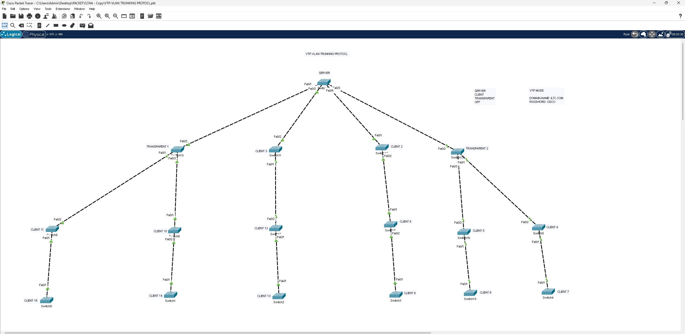

# VTP – VLAN Trunking Protocol

## 📖 الوصف
مشروع يطبق بروتوكول **VTP (VLAN Trunking Protocol)** — بروتوكول سيسكو الذي يتيح إدارة ونشر إعدادات VLAN مركزيًا عبر عدة سويتشات دون الحاجة لإعداد كل سويتش يدويًا.

## 🗺️ التصميم (Topology)

- سويتش مركزي واحد بوضع **VTP Server** يدير المجال (Domain: `ILTC.COM`, كلمة المرور: `cisco`)
- يتفرع منه سويتشان بوضع **Transparent** (لا يستقبلان ولا ينشران تحديثات VTP، لكن يمررانها)
- من كل سويتش Transparent يتفرع مسار من عدة سويتشات بوضع **Client** (تستقبل إعدادات VLAN تلقائيًا من السيرفر)

### أوضاع VTP المستخدمة في التصميم
| الوضع | الوظيفة |
|-------|---------|
| **Server** | ينشئ ويعدّل VLANs، وينشرها لباقي السويتشات |
| **Client** | يستقبل إعدادات VLAN تلقائيًا، لا يمكنه التعديل محليًا |
| **Transparent** | لا يشارك في تحديثات VTP، لكنه يمرر الرسائل بين السويتشات المجاورة |

## ⚙️ المفاهيم المطبقة
- إعداد **VTP Domain Name** و**Password** موحّد لجميع السويتشات
- تحديد وضع كل سويتش (Server / Client / Transparent) حسب دوره في الشبكة
- نشر VLANs تلقائيًا من السيرفر لجميع سويتشات Client دون إعداد يدوي متكرر
- فهم آلية **Revision Number** ودورها في تحديد أحدث نسخة من قاعدة بيانات VLAN

## 🎯 الهدف من المشروع
فهم كيفية إدارة VLANs مركزيًا في شبكة كبيرة تضم عشرات السويتشات، وتوفير الوقت والجهد بدلاً من إعداد كل VLAN يدويًا على كل جهاز — مهارة أساسية لإدارة الشبكات المؤسسية الكبيرة.

## 📂 الملف
- [`VTP-Trunking-Protocol.pkt`](./VTP-Trunking-Protocol.pkt) — ملف Packet Tracer الكامل
